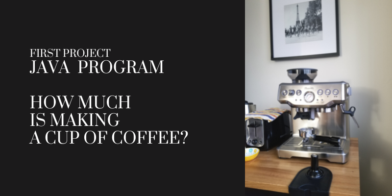
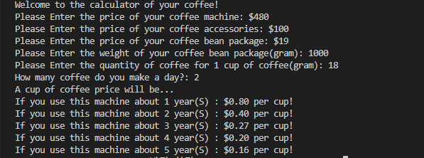

# WhatACupOfCoffeeCosts
This repo contains my very first java code(made in 2019) that calculates the cost of a cup of coffee.

## Overviews
| What a cup of coffee costs? |  
|---------------------|
|  |

| Result |
|---------------------|
|  |

<!-- CONTACT -->
## Contact

Sam Lee - [@LinkedIn](https://www.linkedin.com/in/sam-lee-dev/) - LeeSam235711@gmail.com
